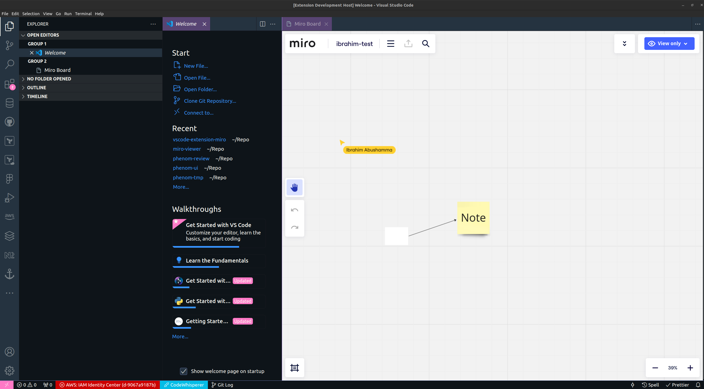

# miro-viewer README

View Miro Board from Vscode

## Features

Use miro as if you are in browser

## Requirements

> We only now support viewable boards

## Extension Settings

TBD

## Known Issues

Calling out known issues can help limit users opening duplicate issues against your extension.

## Release Notes

Users appreciate release notes as you update your extension.

### 0.0.1

Initial release of extension, only supports review board

## TODO List

- [x] Open Boards
- [ ] List down the boards history
- [ ] Bookmarks
- [ ] Authorized to boards

**Enjoy!**
